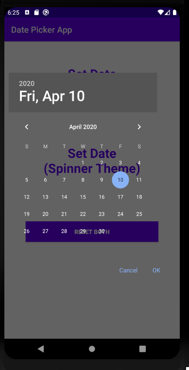

# Date-Picker-App---Android
Set date with DatePicker using both default device calendar and spinner theme (Number picker style).

  

# For Default Theme:
You can create the following method in your java class to simplify your code and call the method from "onCreate(Bundle savedInstanceState) {...}". Here "setDate" is a "TextView" type
object which is holding ID of "Set Date (Default Theme) - TextView" from layout XML file and "dateSetListener" is a "DatePickerDialog.OnDateSetListener"
type object.

```java
private void setGivenDate() {
        setDate.setOnClickListener(new View.OnClickListener() {
            @Override
            public void onClick(View v) {
                //using date-picker-dialog:
                Calendar calendar = Calendar.getInstance();
                int year = calendar.get(Calendar.YEAR);
                int month = calendar.get(Calendar.MONTH);
                int day = calendar.get(Calendar.DAY_OF_MONTH);
                DatePickerDialog dialog = new DatePickerDialog(MainActivity.this,
                        android.R.style.Theme_DeviceDefault_Dialog_MinWidth, dateSetListener,year,month,day);
                dialog.getWindow().setBackgroundDrawable(new ColorDrawable(Color.TRANSPARENT));
                dialog.show();
            }
        });
        dateSetListener = new DatePickerDialog.OnDateSetListener() {
            @Override
            public void onDateSet(DatePicker view, int year, int month, int dayOfMonth) {
                setDate.setText(dayOfMonth+"/"+(month+1)+"/"+year);
            }
        };
    }
 ```
# For Spinner Theme:
Inspired By: David Rawson [GoTo: github.com/drawers/SpinnerDatePicker](https://github.com/drawers/SpinnerDatePicker)

As the ~~SpinnerDatePicker~~ style is deprecated you need to create your own style.

First: you need to add the highlighted dependencies to your project build.gradle(project) and build.gradle(module) files. After adding following lines press "Sync now" and make sure that gradle-Sync is complete successfully.

 

Second: you need to add the new style to styles.xml file from values-directory for spinner theme which is "NumberPickerStyle".

```java
<style name="NumberPickerStyle">
        <item name="android:textSize">22dp</item>
        <item name="android:textColorPrimary">@color/colorPrimary</item>
        <item name="android:colorControlNormal" tools:targetApi="lollipop">@color/colorPrimary</item>
    </style>
```

Now you have to implement the following Interface to your java class and you will get an overriding method called "onDateSet(...)".

```java
public class MainActivity extends AppCompatActivity implements com.tsongkha.spinnerdatepicker.DatePickerDialog.OnDateSetListener {
```
Initialize "SimpleDateFormat" object:

```java
simpleDateFormat = new SimpleDateFormat("dd/MM/yyyy", Locale.US);
```

Do the following code in the following method where "setDateTwo" is a "TextView" type
object which is holding ID of "Set Date (Spinner Theme) - TextView" from layout XML file :

```java
@Override
    public void onDateSet(com.tsongkha.spinnerdatepicker.DatePicker view, int year, int monthOfYear, int dayOfMonth) {
        Calendar calendar = new GregorianCalendar(year, monthOfYear, dayOfMonth);
        setDateTwo.setText(simpleDateFormat.format(calendar.getTime()));
    }
```
You can create the following method in your java class to simplify your code and call the method from "onCreate(Bundle savedInstanceState) {...}".

```java
private void setGivenDateTwo() {
        setDateTwo.setOnClickListener(new View.OnClickListener() {
            @Override
            public void onClick(View v) {
                Calendar calendar = Calendar.getInstance();
                int year = calendar.get(Calendar.YEAR);
                int month = calendar.get(Calendar.MONTH);
                int day = calendar.get(Calendar.DAY_OF_MONTH);

                new SpinnerDatePickerDialogBuilder()
                        .context(MainActivity.this)
                        .callback(MainActivity.this)
                        .spinnerTheme(R.style.NumberPickerStyle)
                        .defaultDate(year, month, day)
                        .build()
                        .show();
            }
        });
    }
```
That's it! Enjoy.
